# Cobo Take Home Test's Answer

## Q1. AI Agent 钱包的用户画像与使用场景

### 用户画像

经过调研和思索后，我会将 Agentic Wallet 的用户画像分为以下两类来进行分析：

1. 人类用户：即谁（人类）在使用这些 Agent 去管理钱包，指向意图实际发起者，也是资产的所有者和最终责任人。
2. 智能体：即哪些 Agent 实际操作/管理了钱包，指向钱包实际操作者。

其中，人类用户决定了风险偏好、授权边界、资金，Agent 在人类设定的边界内自动化地/按需触发地执行交易。

#### 第一层：人类用户画像（即“谁在用 Agentic Wallet”）

- 普通消费者：
  - 描述：有 AI 自主交易需求的普通消费者，希望让 Agent 能代理完成日常消费/转账、内容生成、服务预定等支付
  - 核心需求：保证安全性的同时最大化的提升交易便捷性（个人认为区别于交易效率，此处更强调使用上的便捷性）、无感支付、极简人机交互、更低的钱包创建和恢复门槛、跨境收款等
- 企业用户/DAO 机构用户：
  - 描述：希望让 Agent 能代理处理工资发放、供应商付款、SaaS 订阅，所有支出完整记录可追溯
  - 核心需求：资金池共享、多 Agent 协作、多签集成、分级审批、需要有角色权限控制
- 投资者/DeFi 玩家/量化团队：
  - 描述：希望用 Agent 管理钱包资产，根据市场情况适时调整交易策略，实现自动化交易以套利
  - 核心需求：资产安全、交易效率、策略可调整
- 应用/服务开发者：
  - 描述：开发完应用或智能合约后，测试钱包功能，确保正常运行；或者是应用持续运行时，需要自动购买外部资源等
  - 核心需求：高频 API 交互、沙盒测试环境
- IoT 资产所有者：
  - 描述：希望让 Agent 之间直接进行交易，无需人类干预
  - 核心需求：极高的自主性、无感支付体验、小金额频率高的微支付

#### 第二层：智能体用户画像（即“什么样的 Agent 实际操作/管理了钱包”）

- 对话式 Agent（ChatGPT 等）：每次操作用户看得到，主要服务普通消费者的日常转账
- 编程 Agent（Claude Code/Cursor 等）：开发者自用，操作测试网/沙盒为主
- 交易/策略 Bot：无人值守、7×24 执行套利或定投策略，服务 DeFi 玩家和量化团队
- 任务型助理 Agent：接一个目标自己拆步骤执行,可能跨系统操作，服务普通消费者的复杂任务
- 设备端 Agent / 链上自治 Agent：IoT 设备或链上原生 Agent，自己持有钱包做机器间支付

### 实际使用场景

- 用户直接通过语音指令下单，在某 NFT 项目开放 mint 时自动参与
- 用户使用了个量化 Bot，可以自动交易套利并转账给指定账户
- DAO 机构自动处理工资发放、供应商付款等财务操作，且要保留所有支出完整记录以方便追溯
- 用户开发了一个私人 AI 助手程序部署在服务器上，当服务器快到期时 Agent 监控自身云服务账单配额等，自动转换稳定币并续费避免服务中断
- 用户的无人车自动充电后，通过 Agent 自动向充电桩 Agent 支付费用

## Q2. 设计 AI Agent 钱包需要重点解决的问题（3 个以内）

### 重点1：资产安全性与交易便捷性的平衡

问题本质：如何在保证 Agent 自主决策的同时又能保证资产安全性？

问题举例：如果完全由 Agent 自由决策不加限制和确认可能出岔子，但是笔笔交易都通过用户确认又丧失了交易效率和 Agent 自主性

解决方案：私钥隔离 + 策略引擎 + 分级授权 + 紧急熔断

- 私钥隔离：Agent 不直接持有主私钥，只能通过受控签名模块发起交易
- 策略引擎：在签名前统一过一道策略检查，包括但不限于：
  - 金额维度：单笔上限、每日/周/月等阶段累计金额上限
  - 对方维度：是否在地址白名单/黑名单中
  - 频率维度：每分钟/小时等阶段内交易次数上限
  - 方法维度：使用的方法是否在白名单/黑名单内
- 分级授权：低于某阈值的交易可自动执行（但使用 Session Key，到期自动失效以保证安全性），高于阈值的进入等待队列，等待人工确认；超出硬边界的直接拒绝
- 紧急熔断：提供一键熔断功能，在异常情况（如交易量异常、用户确认失败等）超出用户限制或用户（或委托人）手动触发关停时触发警报时，钱包可自动熔断禁止后续操作，防止资产损失并及时推送提醒用户

### 重点2：意图理解的确定性

问题本质：LLM 可能会出现幻觉，而链上交易又是不可逆的，如何确保 Agent 的决策是准确的？

问题举例：LLM 幻觉导致理解转账金额错误（转账 0.1 转成了 100）、合约地址错误（转入了虚假的合约地址）、忽略用户设定的交易限额等等

解决方案：结构化意图 + 预检 + 人类可读确认

- 所有操作必须经过 Intent → Transaction 两步：
  - Agent 先生成结构化 Intent（JSON：action、to、amount、token），不是自由文本
  - 钱包把 Intent 翻译成人类可读的总结文本（"你将向 0xabc...def 转账 0.1 ETH，手续费约 $0.50"），供 Agent 自检（多 Agent 交叉检查）或用户确认
- 关键字段做二次校验：地址做 checksum 校验、金额做单位校验（wei/gwei/ether 不能搞混）、余额做预扣减检查等
- 对高危操作必须由用户确认后才能执行（重点 1 中的策略引擎），不能由 Agent 自动执行
- 模拟交易：在交易上链前先在影子环境模拟交易，确保交易结果符合预期，再上链执行；否则若与意图不符直接拦截

### 重点3：可观测与可审计

问题本质：交易需可观测、可审计，用以异常定位及策略调整。

问题举例：Agent 可能一晚上跑几百笔交易。出了问题（亏钱、被攻击、行为异常），必须能回溯"Agent 为什么做这个决定、钱包为什么允许这个决定"

解决方案：全链路结构化日志 + 决策溯源

- 每个请求分配 request_id，贯穿 Intent 生成 → 策略校验 → 签名 → 广播 → 确认
- 日志记录（举例）：
  - Agent 的原始 prompt（包括决策链 CoT）加盐哈希或加密文本（避免隐私泄露又可用于自证）
  - 生成的 Intent
  - 决策上下文快照（比如币种汇率、舆情指数等）& 策略引擎的判断路径（为什么通过/拒绝）
  - 链上 tx hash
- 提供查询接口，支持按时间、地址、金额范围、策略命中情况检索
- 异常行为触发 alert，及时推送提醒用户

## Q3. AI Agent 钱包的架构设计

```mermaid
flowchart TD
    U[人类用户<br/>资产所有者 / 意图发起者] --> A[AI Agent]
    U --> C[策略设置 <br/>额度 / 白名单 / 黑名单 / 风险偏好 / 授权边界]

    A --> I[意图解释层 <br/>生成结构化 Intent]
    I --> V[意图校验<br/>地址校验 / 金额单位校验 / 余额检查]

    V --> P[策略引擎<br/>金额限制 / 频率限制 / 对手方规则 / 方法白名单]
    C --> P

    P --> D{风险分级}
    D -->|低风险| S1[Session Key + 受控签名模块<br/>自动签名执行]
    D -->|中风险| Q[加入队列，等待用户确认]
    D -->|高风险| R[直接拒绝]

    Q --> U2[人类可读确认]
    U2 -->|确认| S2[受控签名模块]
    U2 -->|拒绝| R

    S1 --> M[交易模拟]
    S2 --> M

    M --> X{模拟成功}
    X -->|是| B[广播上链]
    X -->|否| R

    B --> CH[ Smart Contracts 链上执行]
    CH --> T[交易结果]

    %% 可观测与可审计
    I -.-> O[全链路结构化日志]
    V -.-> O
    P -.-> O
    D -.-> O
    M -.-> O
    B -.-> O
    T -.-> O

    O --> L[可查询 按时间 / 地址 / 金额 / 策略命中检索]
    O --> AL[异常行为告警]
    AL --> F[一键熔断 / 自动暂停]

    F --> S1
    F --> S2
```

## Collaborate with AI

1. 使用 Gemini、Claude、ChatGPT 等智能体了解相关 Web3 背景知识（多智能体交叉使用避免幻觉内容误导）
2. 阅读 ETH 官方文档等文档，观看相关视频，吸收知识后，与上述智能体描述自己总结的内容，以确认是否理解相关概念（同样地，交叉使用避免单个信源幻觉误导，后不再赘述）
3. 做完产品分析规划以及设计架构后，用上述智能体进行 Review，确认是否符合需求
4. 使用 Cursor + Opus 4.7/Codex 5.3 和 Trae + Gemini 3.1 Pro 进行分步骤实现
